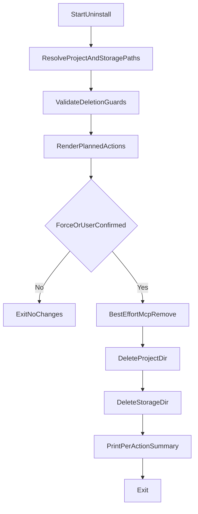

# Uninstall Scripts Implementation Plan

## Goals

- Add first-class uninstall entrypoints mirroring installer UX for both platforms:
  - [scripts/uninstall.ps1](scripts/uninstall.ps1)
  - [scripts/uninstall.sh](scripts/uninstall.sh)
- Remove only Claude-Context-Local artifacts and registration:
  - App checkout (`%LOCALAPPDATA%\\agent-context-code` / `~/.local/share/agent-context-code`)
  - Storage root (`CODE_SEARCH_STORAGE` override or default `~/.claude_code_search`)
  - MCP registration `code-search`
- Never remove shared prerequisites (`uv`, Python, Git), per your selected safety policy.

## Existing Behavior To Mirror

- Reuse installer conventions from:
  - [scripts/install.ps1](scripts/install.ps1)
  - [scripts/install.sh](scripts/install.sh)
- Keep parity with install defaults and path derivation:
  - Windows defaults from `param(...)` in `install.ps1`
  - Unix defaults from `PROJECT_DIR` / `STORAGE_DIR` in `install.sh`
- Align with README install/onboarding references in [README.md](README.md), especially `claude mcp add code-search ...` flows.

## Script Design (Safety-First)

- **Default mode:** non-destructive preview + explicit confirmation before deleting anything.
- **Strict path guards:** refuse deletion unless target path exactly matches expected app/storage roots (after normalization/expansion), preventing accidental broad deletes.
- **No shared tooling removal:** script output explicitly states shared tools remain installed by design.
- **Best-effort MCP cleanup:** attempt `claude mcp remove code-search`; if CLI missing/fails, print actionable manual step and continue.
- **Clear status summary:** report each action as `removed | skipped-not-found | failed` and an overall completion state.

## Proposed CLI Surface

- PowerShell (`uninstall.ps1`):
  - Parameters: `ProjectDir`, `StorageDir`, `Force`, `SkipMcpRemove`, `WhatIf`.
- Bash (`uninstall.sh`):
  - Flags: `--project-dir`, `--storage-dir`, `--force`, `--skip-mcp-remove`, `--dry-run`.
- Behavioral parity:
  - Without force: show what will be removed + prompt.
  - With force: proceed non-interactively.
  - Dry-run/WhatIf: no deletion, only planned actions/status.

## Implementation Steps

1. Add [scripts/uninstall.ps1](scripts/uninstall.ps1)
  - Implement helper functions for section output, path normalization/validation, safe delete, MCP removal attempt, and summary rendering.
  - Use `Remove-Item -Recurse -Force` only after path guards + confirmation gates pass.
2. Add [scripts/uninstall.sh](scripts/uninstall.sh)
  - Implement equivalent helpers (`realpath`/fallback normalization, guard checks, `rm -rf` only after gate checks, interactive prompt handling, summary).
3. Add README uninstall documentation in [README.md](README.md)
  - Add uninstall commands for PowerShell and Unix (remote execution form + local script form).
  - Document exactly what is removed and explicitly what is not removed (shared tools).
  - Include a short recovery/manual cleanup section if MCP remove cannot run automatically.
4. Optional integration touchpoint in installers
  - In [scripts/install.ps1](scripts/install.ps1) and [scripts/install.sh](scripts/install.sh), append a one-line pointer to uninstall command in final notes for discoverability.

## Validation Plan

- Manual validation matrix (Windows + Unix):
  - Fresh uninstall when app/storage exist.
  - Re-run uninstall when paths already absent (idempotency).
  - Dry-run/WhatIf mode does not delete.
  - `--force`/`-Force` non-interactive removal works.
  - Custom `CODE_SEARCH_STORAGE` path respected.
  - MCP remove succeeds when `claude` exists; graceful warning when it does not.
- Safety checks:
  - Verify guard blocks dangerous inputs like root/home-wide paths and unexpected path mismatches.

## Post-Implementation Review Workflow

- Dispatch a readonly code-review subagent after scripts/docs are added.
- Prioritize findings: safety regressions, path guard gaps, destructive edge cases, docs mismatches, and missing idempotency handling.
- Apply fixes for all valid findings and rerun lint/spot checks on changed files.

## Mermaid Flow (Intended Uninstall Control)

